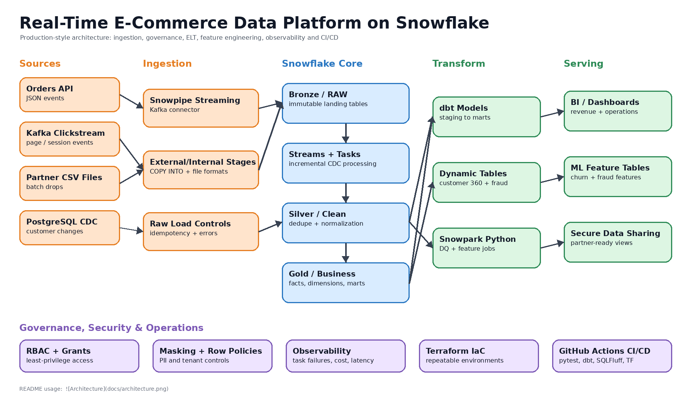

# Real-Time E-Commerce Data Platform on Snowflake

**Hristina Todorova** · [hktodorova@gmail.com](mailto:hktodorova@gmail.com)


---

Production-style Snowflake analytics platform implementing real-time ingestion, medallion architecture, analytics engineering, governance, observability and infrastructure automation.

## Quick Recruiter Summary

This project demonstrates practical Snowflake Data Engineering skills:

* SQL-based ELT pipelines
* Snowflake Streams, Tasks and Dynamic Tables
* dbt models, tests and snapshots
* Snowpark Python for data quality and feature engineering
* Terraform Infrastructure as Code
* GitHub Actions CI/CD
* Governance with RBAC, masking and row access policies
* Kafka / Snowpipe Streaming ingestion example

Best fit: Snowflake Data Engineer, Analytics Engineer, Data Platform Engineer.

---

This is my personal portfolio project — a full data platform built on Snowflake for an e-commerce use case. I built it to demonstrate how I would approach a production-style setup end-to-end, not just the transformation layer.

The implementation intentionally prioritizes production-oriented patterns over minimal examples. The stack includes ingestion (batch + streaming), a Bronze/Silver/Gold medallion model, dbt for transformations, Snowpark for ML features, governance with RBAC and masking, observability with alerts, and Infrastructure as Code using Terraform.

Key architectural decisions and tradeoffs are documented in `docs/technical_design.md`.

## Architecture



## Key Features

* Real-time ingestion with Snowpipe Streaming
* Bronze / Silver / Gold medallion architecture
* dbt incremental models and snapshots
* Snowpark-based feature engineering
* Governance with RBAC, masking and row access policies
* CI/CD validation with GitHub Actions
* Infrastructure as Code using Terraform
* Dynamic Tables for low-latency analytics marts
* Streams & Tasks for incremental processing
* Observability and warehouse monitoring

## Repository Structure

```text
sql/          → setup, ingestion, transformations, governance, observability (run in order)
dbt/          → Bronze views, Silver incremental models, Gold marts, feature engineering
snowpark/     → Snowpark Python jobs for feature computation and data quality
terraform/    → infrastructure as code (warehouses, roles, schemas)
kafka/        → Snowpipe Streaming example for CDC and clickstream ingestion
docs/         → architecture diagram and technical design decisions
scripts/      → local data generator so the project can run without live upstream systems
tests/        → smoke test validating repository structure and local execution
```

## Running Locally

```bash
python -m venv .venv
.venv\Scripts\activate          # on Windows

pip install -r requirements.txt

python scripts/generate_sample_data.py
python snowpark/data_quality_local_demo.py
python tests/smoke_test_project.py
```

## Running on Snowflake

Execute the SQL files in the following order:

```text
sql/00_setup/01_roles_warehouses_databases.sql
sql/00_setup/02_file_formats_stages.sql
sql/01_ingestion/01_raw_tables.sql
sql/01_ingestion/02_copy_and_snowpipe.sql
sql/02_transformations/01_streams_tasks.sql
sql/02_transformations/02_dynamic_tables.sql
sql/03_governance/01_security_governance.sql
sql/04_observability/01_monitoring_views.sql
```

Then execute dbt:

```bash
cd dbt

dbt deps
dbt seed
dbt snapshot   # SCD2 customer history
dbt run
dbt test
dbt parse --profiles-dir .
```

## CI/CD

GitHub Actions validates:

* SQLFluff linting
* dbt dependency installation and validation
* pytest execution
* Terraform formatting and validation

## Performance Considerations

* Incremental dbt models reduce unnecessary full-table scans
* Warehouses are isolated by workload (ingest / transform / analytics / ML)
* Streams & Tasks minimize recomputation for CDC processing
* Dynamic Tables are used selectively for low-latency marts
* Raw tables retain full VARIANT payloads to simplify replay after schema evolution
* Feature tables store `run_id` and `as_of_timestamp` for ML reproducibility

## Governance & Security

* Role-based access control (RBAC)
* Column masking policies for PII
* Row access policies for regional filtering
* Environment isolation through Terraform-managed infrastructure
* No credentials or secrets committed to source control

## Credentials

No credentials, secrets or environment-specific configuration are committed to this repository.

Use environment variables or a secret manager of your choice for Snowflake connectivity.