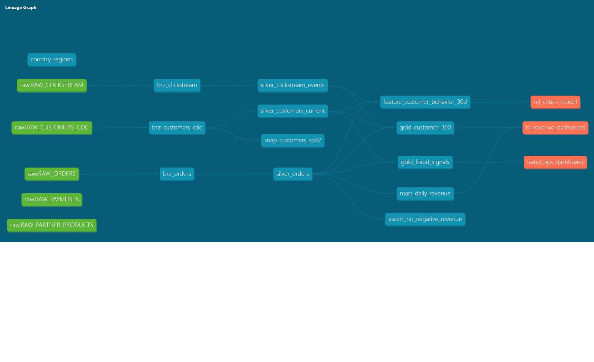

# Real-Time E-Commerce Data Platform on Snowflake

**Hristina Todorova** · [hktodorova@gmail.com](mailto:hktodorova@gmail.com)


---

Production-style Snowflake analytics platform implementing real-time ingestion, analytics engineering, governance, observability and infrastructure automation on top of Snowflake.

The project simulates a modern enterprise-grade e-commerce analytics platform with batch and streaming ingestion, medallion architecture, data quality validation, security governance and business-facing analytics marts.

---

# Quick Recruiter Summary

This repository demonstrates hands-on experience with:

* Snowflake ELT pipelines
* dbt transformations, tests and lineage
* Snowflake Streams, Tasks and Dynamic Tables
* Snowpipe Streaming ingestion
* Snowpark Python feature engineering
* Terraform Infrastructure as Code
* GitHub Actions CI/CD workflows
* RBAC, masking and row-level governance
* Analytics Engineering and Gold-layer marts

### Target Roles

* Snowflake Data Engineer
* Analytics Engineer
* Data Platform Engineer
* Cloud Data Engineer

---

# Tech Stack

| Layer | Technology |
|---|---|
| Data Warehouse | Snowflake |
| Transformations | dbt |
| Programming | Python |
| Streaming | Kafka / Snowpipe Streaming |
| Infrastructure | Terraform |
| CI/CD | GitHub Actions |
| Data Quality | dbt tests + Snowpark |
| Security | RBAC + Masking Policies |
| Monitoring | Snowflake Monitoring Views |
| Data Modeling | Bronze / Silver / Gold Medallion Architecture |

---

# Project Overview

This is a production-oriented Snowflake data platform built for a simulated real-time e-commerce environment.

The implementation demonstrates how modern cloud-native analytics platforms can be designed end-to-end using scalable ingestion patterns, modular transformations, governance, observability and infrastructure automation.

The project intentionally prioritizes realistic enterprise architecture patterns over simplified tutorial-style examples.

### Core Platform Capabilities

* Batch and streaming ingestion
* Bronze / Silver / Gold medallion architecture
* Incremental ELT processing
* Analytics-ready Gold marts
* Data quality monitoring
* Role-based governance
* Infrastructure as Code
* CI/CD automation
* ML feature engineering workflows

---

# Business Impact

This platform simulates real-world enterprise analytics scenarios commonly found in modern digital commerce organizations.

### Business Use Cases

* Customer 360 analytics
* Revenue and sales reporting
* Product performance analysis
* Fraud signal generation
* Operational KPI dashboards
* Historical trend analysis
* Real-time clickstream analytics
* Customer segmentation and behavioral analysis

### Business Benefits

* Centralized and governed analytics platform
* Faster and more reliable reporting
* Reduced manual data processing
* Improved data consistency across teams
* Scalable architecture for future growth
* Secure access control and sensitive data protection
* Reduced operational overhead through automation

---

# Architecture


### Core Architecture Components

* Snowpipe Streaming for near real-time ingestion
* Bronze / Silver / Gold medallion architecture
* dbt-based transformation layer
* Snowpark Python feature engineering
* Terraform-managed infrastructure
* Governance and security policies
* Observability and warehouse monitoring
* Incremental processing using Streams & Tasks

---

# dbt Lineage

The project uses dbt lineage tracking to provide transparent dependency management and end-to-end visibility across ingestion, transformations, analytics marts and ML feature generation.

The lineage graph below demonstrates the complete flow from raw ingestion to business-ready Gold marts and downstream analytics exposures.



---

# Why These Design Decisions

## Medallion Architecture (Bronze / Silver / Gold)

The medallion architecture was selected to separate raw ingestion, standardized transformations and business-ready analytics layers.

### Benefits

* Improved maintainability
* Better data quality management
* Easier debugging and lineage tracking
* Clear separation of concerns

---

## dbt for Transformations

dbt was used to implement modular SQL transformations, testing, lineage tracking and reusable analytics logic.

### Benefits

* Version-controlled transformations
* Built-in testing and documentation
* Modular analytics engineering workflows
* Faster development cycles

---

## Snowflake Dynamic Tables

Dynamic Tables were selected to simplify incremental processing and reduce orchestration complexity.

### Benefits

* Automated refresh management
* Reduced operational overhead
* Simplified low-latency analytics pipelines

---

## Snowpipe Streaming

Snowpipe Streaming enables continuous ingestion of clickstream and CDC-style events.

### Benefits

* Near real-time ingestion
* Scalable event processing
* Reduced manual ingestion management

---

## Terraform Infrastructure as Code

Terraform was used to provision Snowflake infrastructure consistently across environments.

### Benefits

* Reproducible infrastructure
* Environment consistency
* CI/CD integration readiness
* Easier operational management

---

## Governance & Security

RBAC, masking policies and row-level security were implemented to simulate enterprise governance requirements.

### Benefits

* Secure access control
* Protection of sensitive information
* Compliance-oriented architecture
* Fine-grained data governance

---

# Data Quality Strategy

The platform implements multiple layers of data quality validation.

### Data Quality Features

* dbt schema and relationship tests
* Snowpark validation checks
* Freshness validation for ingestion pipelines
* Duplicate detection
* Null and anomaly monitoring
* CI/CD validation in GitHub Actions

This simulates production-grade data reliability practices commonly used in enterprise analytics platforms.

---

# Scalability Considerations

The architecture was designed with scalability and operational simplicity in mind.

### Scalability Patterns

* Workload-isolated Snowflake warehouses
* Incremental processing using Streams & Tasks
* Modular dbt model structure
* Decoupled ingestion and transformation layers
* Infrastructure automation with Terraform
* Low-latency analytics using Dynamic Tables

---

# Architectural Tradeoffs

Several implementation decisions intentionally prioritize simplicity, maintainability and readability over maximum optimization.

### Examples

* Dynamic Tables were selected to reduce orchestration complexity
* Snowpark jobs remain lightweight to minimize compute costs
* The project uses a simplified CDC simulation instead of a fully distributed Kafka setup
* The architecture favors modularity and observability over minimal infrastructure footprint

These tradeoffs reflect realistic engineering decision-making in modern cloud data platforms.

---

# Repository Structure

```text
sql/          → setup, ingestion, transformations, governance, observability
dbt/          → Bronze views, Silver incremental models, Gold marts
snowpark/     → Snowpark Python jobs for feature engineering and data quality
terraform/    → infrastructure as code (warehouses, roles, schemas)
kafka/        → Snowpipe Streaming examples for CDC and clickstream ingestion
docs/         → architecture diagrams and technical design decisions
scripts/      → local sample data generation
tests/        → smoke tests and validation
```

---

# Running Locally

```bash
python -m venv .venv
.venv\Scripts\activate

pip install -r requirements.txt

python scripts/generate_sample_data.py
python snowpark/data_quality_local_demo.py
python tests/smoke_test_project.py
```

---

# Running on Snowflake

Execute SQL scripts in the following order:

```text
sql/00_setup/01_roles_warehouses_databases.sql
sql/00_setup/02_file_formats_stages.sql
sql/01_ingestion/01_raw_tables.sql
sql/01_ingestion/02_copy_and_snowpipe.sql
sql/02_transformations/01_streams_tasks.sql
sql/02_transformations/02_dynamic_tables.sql
sql/03_governance/01_security_governance.sql
sql/04_observability/01_monitoring_views.sql
```

Then execute dbt:

```bash
cd dbt

dbt deps
dbt seed
dbt snapshot
dbt run
dbt test
dbt parse
```

---

# CI/CD

GitHub Actions validates:

* SQLFluff linting
* dbt dependency installation and validation
* pytest execution
* Terraform formatting and validation

---

# Performance Considerations

* Incremental dbt models minimize unnecessary full-table scans
* Warehouses are isolated by workload (ingest / transform / analytics / ML)
* Streams & Tasks reduce recomputation overhead
* Dynamic Tables are used selectively for low-latency marts
* Raw tables retain full VARIANT payloads for replay and schema evolution
* Feature tables include `run_id` and `as_of_timestamp` for ML reproducibility

---

# Governance & Security

* Role-based access control (RBAC)
* Column masking policies for PII
* Row access policies for regional filtering
* Terraform-managed environment isolation
* No secrets or credentials committed to source control

---

# Credentials

No credentials, secrets or environment-specific configuration are committed to this repository.

Use environment variables or a secure secret-management solution for Snowflake connectivity.

---

# Key Learnings

This project deepened my understanding of:

* modern ELT architectures
* Snowflake governance patterns
* analytics engineering workflows
* dbt-based transformation development
* infrastructure-as-code for data platforms
* balancing scalability, simplicity and maintainability
* incremental processing strategies
* production-style data platform design

---

# Future Improvements

Potential next enhancements:

* Apache Airflow orchestration
* dbt semantic layer
* Great Expectations integration
* Iceberg external tables
* Cost optimization dashboards
* ML feature store integration
* Real-time alerting pipelines
* Multi-environment deployment automation
* End-to-end observability dashboards