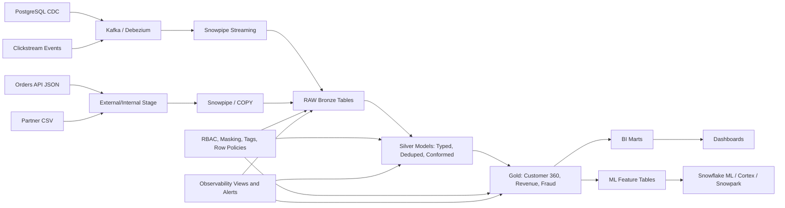

# Architecture

Data comes in from two directions: batch files (orders JSON, partner CSVs) land on a Snowflake stage and get loaded via COPY/Snowpipe, while CDC and clickstream go through Kafka/Debezium into Snowpipe Streaming. Everything hits the same raw bronze tables.

## Layers

**Bronze** — raw VARIANT payloads plus ingestion metadata. Nothing is parsed or dropped here. If something breaks downstream you can always re-derive from these tables.

**Silver** — typed, deduped, conformed. This is where the merge logic, CDC handling and SCD2 versioning live. dbt incremental models with merge strategy.

**Gold** — business-level aggregations: Customer 360, daily revenue, fraud signals. Mix of dbt tables and Dynamic Tables depending on how often they need to refresh.

**Features** — 30-day behaviour features for ML. Designed to be reproducible — you can pass an `as_of_timestamp` to get exactly the feature values that existed at a given point in time.

## Warehouses

Four warehouses, each sized for its workload:

- `WH_INGEST_XS` — Snowpipe and COPY. Kept small because these are mostly I/O-bound.
- `WH_TRANSFORM_M` — dbt runs, Streams/Tasks, Dynamic Table refreshes. Multi-cluster during heavy loads.
- `WH_ANALYTICS_S` — BI queries and ad-hoc. Multi-cluster with STANDARD scaling so concurrent users don't queue.
- `WH_ML_M` — Snowpark feature jobs. Separate to avoid Snowpark memory pressure affecting BI.

All warehouses share one resource monitor. Auto-suspend is tuned per warehouse — shorter for ingest, longer for ML where cold start is expensive.
